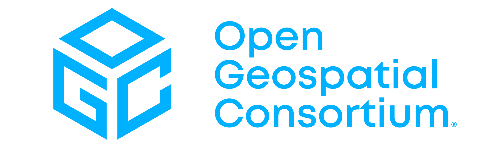
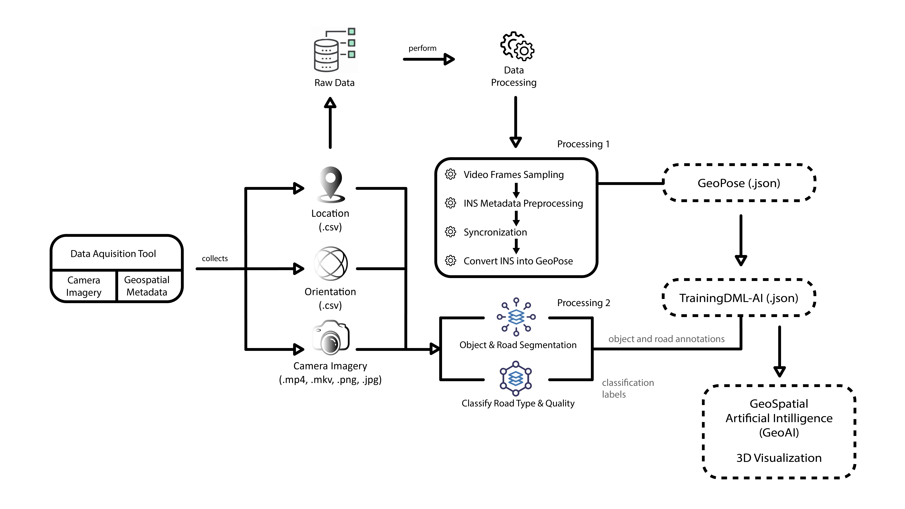
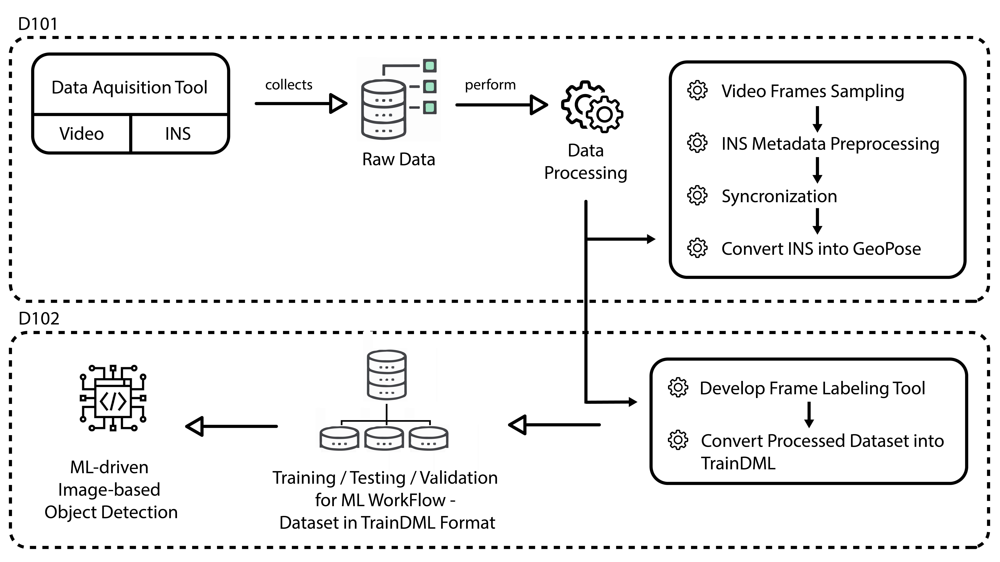
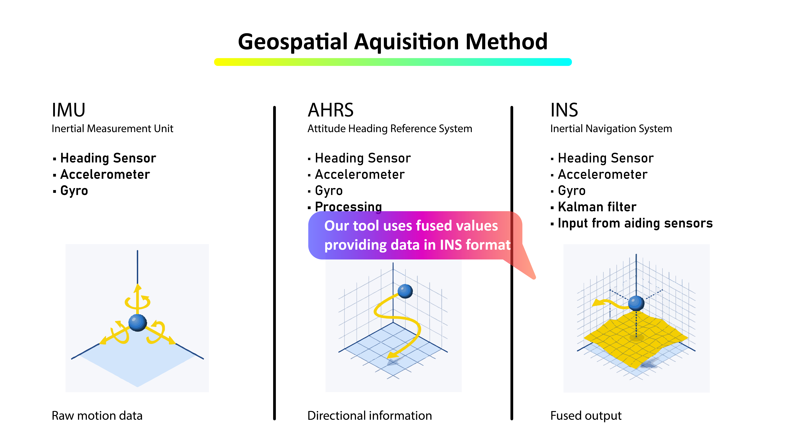
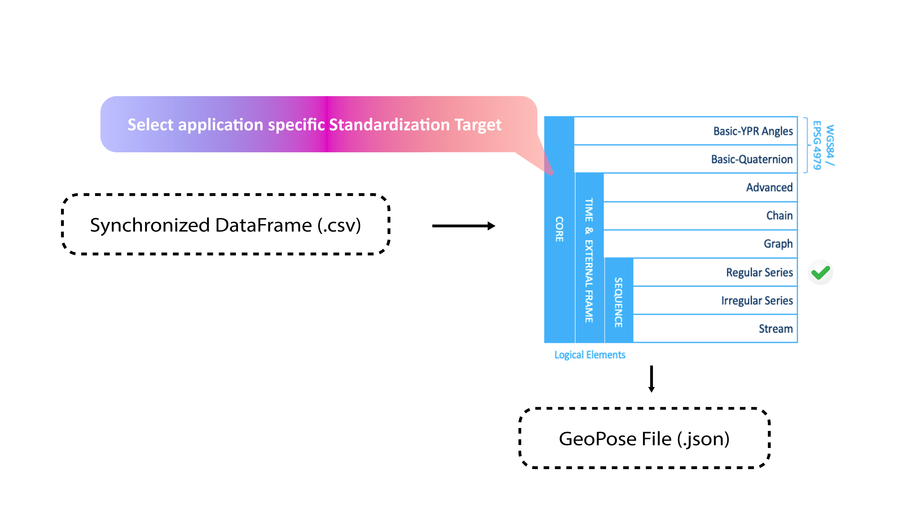
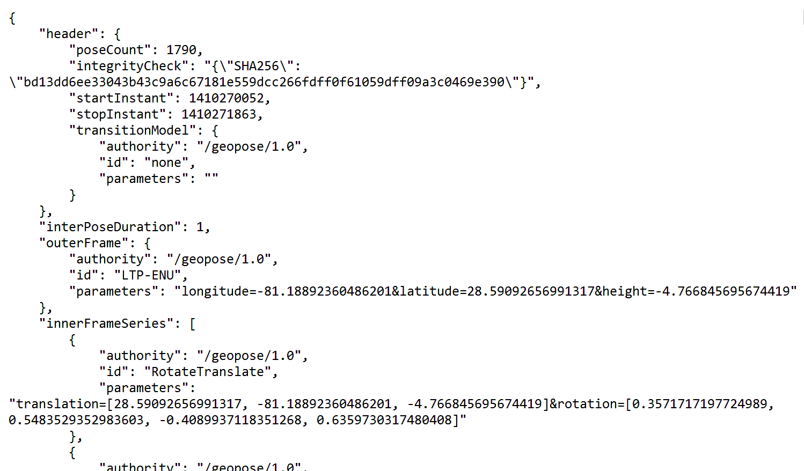
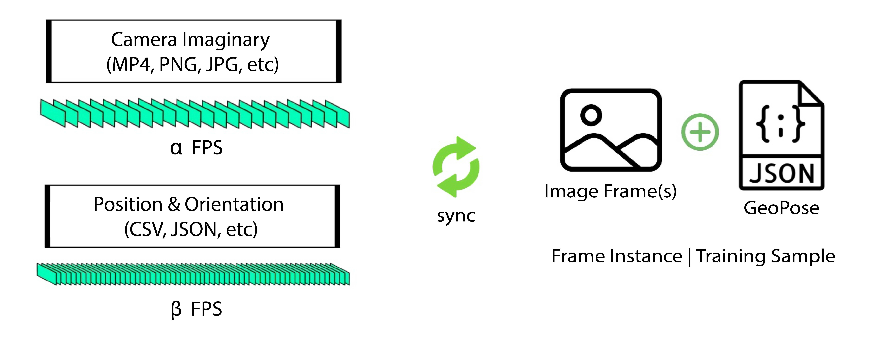
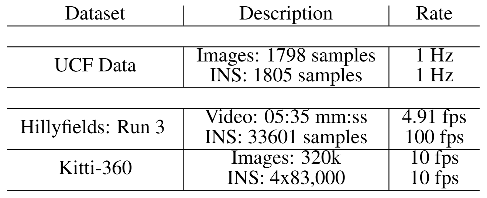
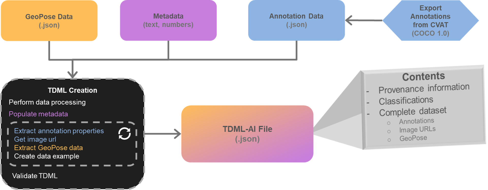

# OGC-UDTIP

## Urban Digital Twin Interoperability Pilot (UDTIP)

Welcome to UCF's contributions to the [OGC UDTIP Pilot Project](http://udtip-ogc-a11732165e22b16b1ecaa5688ea04b2e604ab31983bf161b60aea.pages.ogc.org/documents/D001/document.html), focusing on **standardized pipelines for geospatial data integration**. This repository documents my work for the D101 deliverable, emphasizing **GeoPose-enabled Camera Imagery Interoperability**, **GeoAI**, and **Machine Learning** within Urban Digital Twin systems.

---

## 📄 Key Artifacts

- **D101 Deliverable:** [OGC UDTIP D101 Artifact](https://portal.ogc.org/files/?artifact_id=108023)
- **Related Paper:** [GeoPose-enabled Camera Imagery Interoperability with Geo-AI in Urban Digital Twins](https://doi.org/10.5194/isprs-archives-XLVIII-G-2025-1427-2025)

---

## 🚀 Project Overview

Our work advances open, interoperable urban digital twins by:

- **GeoPose-enabled Camera Imagery Interoperability**
- **TrainDML with GeoAI & Machine Learning**
- **Urban Digital Twin Systems Integration**

---

## 🗺️ Roadmap

- **D101:** Camera Imagery Interoperability (GeoPose, standardization, data pipelines)
- **D102:** TrainDML-AI standard & ML for GeoAI applications

---

## 📷 Data Acquisition & Standardization

### INS vs AHRS & IMU

Our approach leverages **Inertial Navigation Systems (INS)** for high-precision pose estimation, outperforming traditional IMU and AHRS solutions.

### INS to GeoPose Conversion

We developed a robust **GeoPose script** for converting INS data to standardized GeoPose format, ensuring interoperability.

---

## 🗃️ GeoPose JSON Output

Sample output of a standardized GeoPose Sequence Regular Series in JSON format:

---

## 🔄 Synchronization

Synchronizing real-world heterogeneous sensor data with GIS information is essential for accurate GeoPose generation and urban digital twin fidelity.

---

## 📊 Dataset Comparison

A comparative analysis of datasets for urban digital twin applications, including our custom dataset.

---

## 🧠 TrainDML & GeoAI

Our D102 deliverable demonstrates the use of the **TrainDML-AI standard** and machine learning for GeoAI applications on captured data.

 <!-- Replace with actual diagram -->

---

## 📚 Learn More

- [OGC UDTIP Project Overview](http://udtip-ogc-a11732165e22b16b1ecaa5688ea04b2e604ab31983bf161b60aea.pages.ogc.org/documents/D001/document.html)
- [OGC UDTIP D101 Artifact](https://portal.ogc.org/files/?artifact_id=108023)
- [ISPRS Paper](https://doi.org/10.5194/isprs-archives-XLVIII-G-2025-1427-2025)

---

## 🤝 Acknowledgements

This work is part of the OGC Urban Digital Twin Interoperability Pilot, with contributions from UCF and the broader OGC community.

---

*For questions or collaboration, please open an issue or contact the contributors through the OGC portal.*